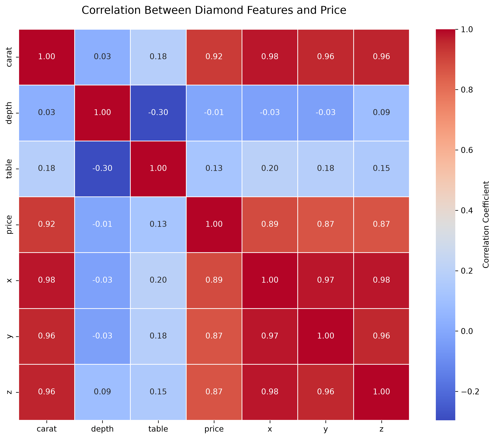
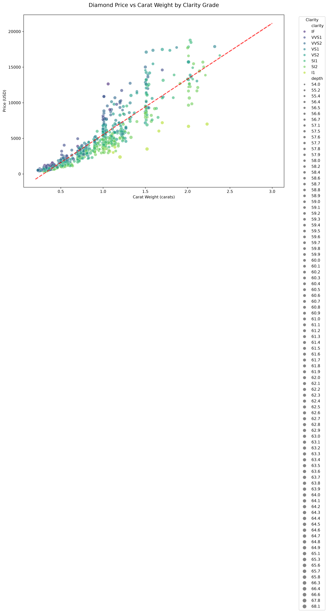

# Module 10: Diamond Price Analysis Dashboard

## Research Question

**Can the price of a diamond be determined based upon its features?**

This project explores the relationships between diamond characteristics (carat weight, cut quality, color grade, clarity, and physical dimensions) and market price. The goal is to identify which features are most predictive of diamond value and to present these findings in an interactive dashboard.

## Dataset

- **Source**: Seaborn diamonds dataset (`sns.load_dataset("diamonds")`)
- **Size**: 53,940 diamond observations
- **Variables**: Carat, cut, color, clarity, depth, table, price, x, y, z
- **Why this dataset**: It is clean, well-structured, and contains clear relationships between features and price, making it ideal for exploratory visualization and dashboarding.

## Setup and Installation

### 1. Navigate to the project folder

### 2. Create a virtual environment
python -m venv venv
source venv/bin/activate # On macOS/Linux
venv\Scripts\activate # On Windows

### 3. Install dependencies
pip install -r requirements.txt
### 4. Generate visualizations
python visualization.py
This will generate 4 visualizations in the `plots/` folder:
- `correlation_heatmap.png`
- `diamond_scatter.png`
- `diamond_3d_interactive.html`
- `diamond_box_interactive.html`

### 5. Run the dashboard
python dashboard.py

### 6. Open your browser
Navigate to: `http://127.0.0.1:8050`

## Exploratory Data Analysis Summary

### Data Quality
- **Missing values**: None. All 53,940 rows are complete.
- **Outliers**: Prices above $20,000 and carat weights above 3.0 were removed to reduce visual distortion. This affected fewer than 1% of rows.
- **Data types**: All numeric columns were validated as floats.

### Key Findings
- Carat weight shows the strongest correlation with price (0.92).
- Physical dimensions (x, y, z) are also highly correlated with price (0.87–0.89).
- Depth and table have weak correlation with price (0.03 and 0.18).
- Cut quality and clarity create meaningful price differentiation at the same carat weight.

## Visualizations

### 1. Correlation Heatmap

**What it shows**: A correlation matrix of all numeric features in the dataset.

**Key insight**: Carat weight (0.92) and physical dimensions (x, y, z) are the strongest predictors of price. Depth and table have little to no relationship with price.

### 2. Price vs Carat by Clarity

**What it shows**: Price vs carat weight, colored by clarity grade, with a regression line.

**Key insight**: Price increases exponentially with carat weight. Higher clarity grades command higher prices at the same carat weight.

### 3. 3D Interactive Scatter
[View Interactive Plot](plots/diamond_3d_interactive.html)

**What it shows**: 3D scatter plot of price, carat weight, and table size, colored by cut quality. Interactive — users can rotate, zoom, and hover.

**Key insight**: Ideal and Premium cuts tend to have higher prices for the same carat weight.

### 4. Interactive Box Plot
[View Interactive Box Plot](plots/diamond_box_interactive.html)

**What it shows**: Price distribution by cut quality, colored by color grade.

**Key insight**: Better cut grades show higher median prices. Color grades D-F are consistently more expensive.

## Dashboard Screenshot

The dashboard displays all four visualizations on a single page with the research question and explanatory text.

## Conclusions

1. Carat weight is the strongest predictor of diamond price.
2. Clarity and cut quality significantly impact price at the same carat weight.
3. Color and dimensions contribute to value but are secondary factors.
4. Depth and table have minimal influence on price.

These are correlations, not causal effects.

## Limitations

- Dataset has no missing values, so cleaning was minimal.
- Price reflects retail pricing; wholesale pricing may differ.
- No certification or provenance data is included.
- All findings are correlational, not causal.

## Dependencies

| Package | Purpose |
|---------|---------|
| pandas | Data loading and manipulation |
| numpy | Numerical operations |
| matplotlib | Static plot generation |
| seaborn | Statistical visualizations |
| plotly | Interactive visualizations |
| dash | Dashboard framework |
| pylint | Code quality checking |
| selenium | Dashboard screenshot helper |

Install all dependencies with:
pip install -r requirements.txt

## Project Structure
module_10/
├── visualization.py
├── dashboard.py
├── requirements.txt
├── README.md
├── take_screenshot.py
└── plots/
├── correlation_heatmap.png
├── diamond_scatter.png
├── diamond_3d_interactive.html
├── diamond_3d_interactive.json
├── diamond_box_interactive.html
├── diamond_box_interactive.json
└── dashboard.png

## License

This project was completed as part of the JHU Software Concepts course.